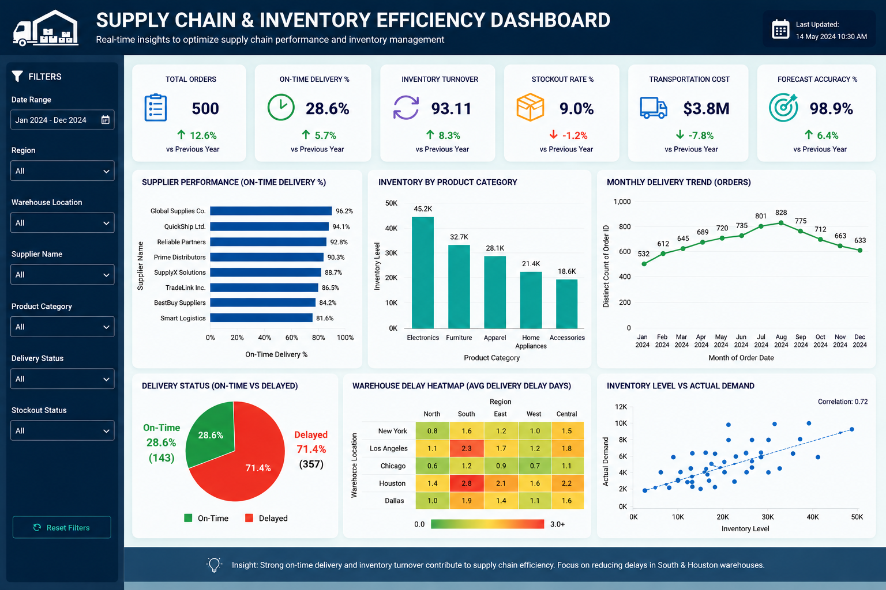

# 📦 Supply Chain Logistics & Inventory Efficiency Dashboard


---

## 📖 Project Overview

The **Supply Chain Logistics & Inventory Efficiency Dashboard** is an interactive Tableau dashboard designed to monitor and analyze logistics operations, inventory performance, transportation costs, delivery efficiency, and forecasting accuracy.
This dashboard provides stakeholders with a centralized view of supply chain performance, enabling data-driven decisions to improve operational efficiency, reduce inventory risks, and optimize logistics processes.

---

## 🎯 Business Objectives

• Monitor supply chain performance across regions, suppliers, and warehouses

• Evaluate delivery efficiency and transportation costs

• Track inventory turnover and stockout risks

• Analyze forecasting accuracy and demand trends

• Identify operational bottlenecks and improvement opportunities

• Support strategic and operational decision-making

---


## 📷 Dashboard Preview




## 📊 Key Performance Indicators (KPIs)

| KPI | Value |
|------|--------|
| Total Orders | 500 |
| On-Time Delivery % | 28.6% |
| Inventory Turnover Ratio | 93.11 |
| Stockout Rate % | 9.0% |
| Transportation Cost | $3.8M |
| Forecast Accuracy % | 98.9% |

---

## 📈 Dashboard Components

### KPI Cards

• Total Orders

• On-Time Delivery %

• Inventory Turnover Ratio

• Stockout Rate %

• Transportation Cost

• Forecast Accuracy %

### Visualizations

#### Supplier Performance Analysis

• Evaluates supplier reliability and delivery performance.

#### Inventory by Product Category

• Provides visibility into inventory distribution across product categories.

#### Monthly Delivery Trend

• Tracks logistics activity and delivery trends over time.

#### Delivery Status Distribution

• Visualizes On-Time and Delayed deliveries through a pie chart.

#### Warehouse Delay Heatmap

• Highlights warehouses contributing to delivery delays.

---

## 🎛 Interactive Filters

The dashboard includes interactive filters to enable detailed analysis:

• Region

• Warehouse Location

• Supplier Name

• Product Category

• Delivery Status

---

## 🛠 Tools & Technologies

| Technology | Description |
|------------|-------------|
| Tableau Desktop | Dashboard creation and visualization |
| Microsoft Excel | Data storage and preparation |
| Data Visualization | Presenting business insights visually |
| Business Intelligence | Performance monitoring and reporting |
| Supply Chain Analytics | Logistics and inventory analysis |
| Inventory Management | Stock level and turnover monitoring |

---

## 📌 Key Insights

• Identified suppliers with lower delivery performance

• Analyzed inventory levels across product categories

• Evaluated transportation costs and logistics efficiency

• Monitored stockout risks and inventory utilization

• Assessed forecasting accuracy for demand planning

• Compared warehouse performance based on delivery delays

---

## 🎨 Dashboard Design Highlights

• Modern dark-themed dashboard design

• Executive-level KPI monitoring

• Interactive and user-friendly experience

• Professional business intelligence layout

• Clear visual storytelling approach

• Recruiter and portfolio-friendly presentation

---

## 📂 Project Structure

```text
Supply-Chain-Logistics-Dashboard
│
├──  Supply_Chain_Dataset.xlsx
│
├──  Supply_Chain_Logistics_Dashboard.twbx
│
├── Dashboard_.Screenshot.png
│
└── README.md
```

---

## 📈 Business Impact

This dashboard provides a centralized view of supply chain and inventory operations, enabling stakeholders to monitor logistics performance, identify inventory risks, and optimize operational efficiency.

#### Key Business Benefits

• Improved supply chain visibility

• Better inventory planning and control

• Reduced stockout risks

• Enhanced supplier performance monitoring

• Optimized transportation cost management

• Data-driven operational decision-making

---


## ✅ Conclusion

The **Supply Chain Logistics & Inventory Efficiency Dashboard** demonstrates how Tableau can transform complex logistics and inventory data into actionable business insights.
By combining KPI monitoring, interactive visualizations, and operational analytics, the dashboard helps organizations improve delivery performance, optimize inventory utilization, reduce operational risks, and support strategic supply chain planning.
This project reflects the practical application of Business Intelligence and Data Visualization techniques in solving real-world supply chain challenges.

---

## 👩‍💻 Author

**Nikhat Jahan**


